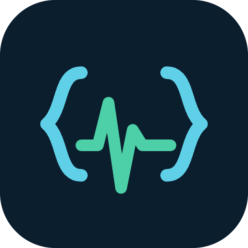

# Anestcode

Códigos **TUSS/CHPM** a partir da descrição cirúrgica. Funciona **100% offline** depois da
primeira abertura.

- 5.778 procedimentos da tabela TUSS, 2.392 com **porte anestésico**
- Navegação por sistema (capítulo → sistema → órgão → procedimento), como no app TUSS
- Cole, dite ou fotografe a descrição → ele acha os procedimentos e sugere os códigos
- Monta o lançamento com a via de cada linha (Única 100% / Mesma 50% / Diferentes 70%)
- Consulta manual da tabela, com porte, auxiliares, custo operacional
- Sem login, sem servidor, sem coleta de dados — tudo fica no aparelho

## Instalar no iPhone

Abra o endereço no Safari → botão compartilhar → **Adicionar à Tela de Início**.

---

Ferramenta de apoio ao faturamento, de uso exclusivo por profissional habilitado.
O código sugerido **precisa ser conferido** no autocomplete do convênio: procedimento,
técnica, órgão e lateralidade têm de bater.
